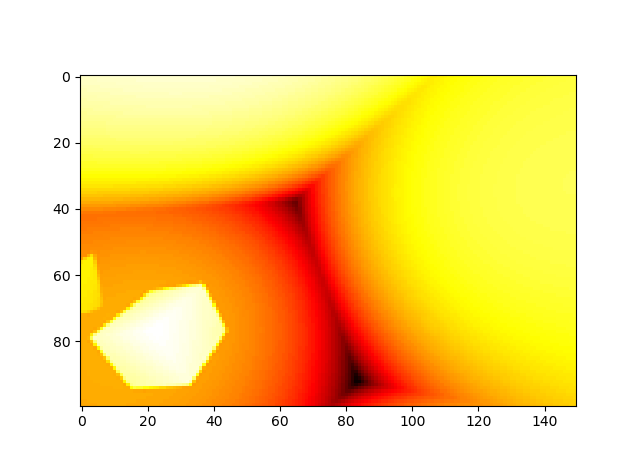

# DenseRecurrentDepthEstimation
A novel approach that estimate Depth-map from Stereo images

Download the dataset from the link below: 

<a href="https://github.com/LouisFoucard/DepthMap_dataset">DepthMap_dataset</a>

Sample stereo images:

Ground truth:

Here is the prediction after 200 epochs:

